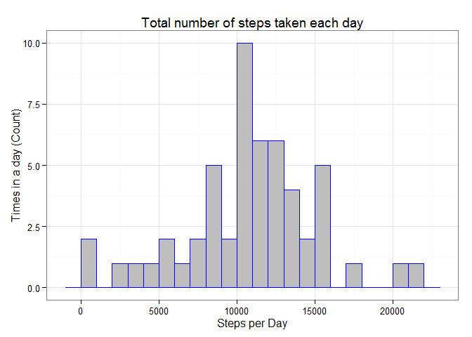
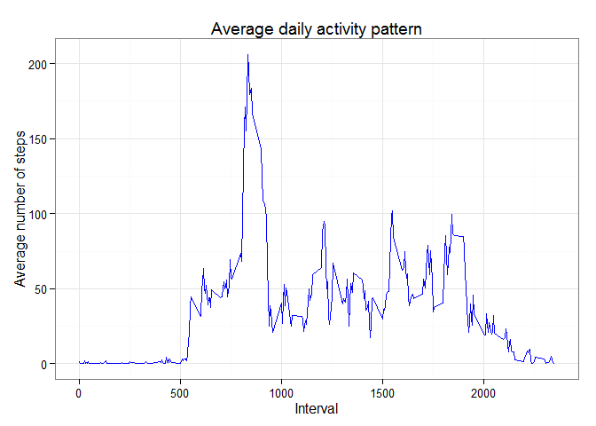
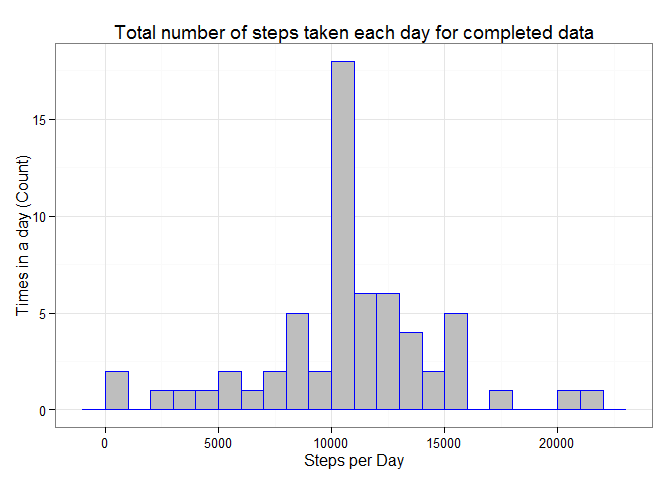
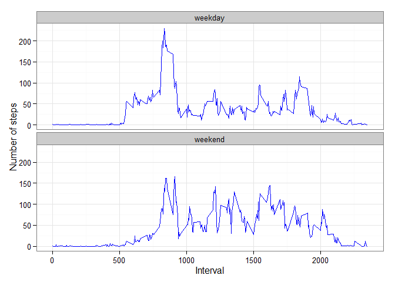

# Reproducible Research: Peer Assessment 1
Alejandro Sanchez  


Loading required libraries

```r
library(ggplot2)
```

## Loading and preprocessing the data


```r
#Unzip data in repo
unzip("activity.zip")
# Read data
data <- read.table(file = "activity.csv", 
                   sep = ",", 
                   header = TRUE)
head(data)
```

```
##   steps       date interval
## 1    NA 2012-10-01        0
## 2    NA 2012-10-01        5
## 3    NA 2012-10-01       10
## 4    NA 2012-10-01       15
## 5    NA 2012-10-01       20
## 6    NA 2012-10-01       25
```

Preview of data frame:

```r
str(data)
```

```
## 'data.frame':	17568 obs. of  3 variables:
##  $ steps   : int  NA NA NA NA NA NA NA NA NA NA ...
##  $ date    : Factor w/ 61 levels "2012-10-01","2012-10-02",..: 1 1 1 1 1 1 1 1 1 1 ...
##  $ interval: int  0 5 10 15 20 25 30 35 40 45 ...
```

Transform column date to class date:

```r
data$date <- as.POSIXct(data$date, format="%Y-%m-%d")
```

## What is mean total number of steps taken per day?
Build the data frame with number of steps per day:

```r
data_per_day <- aggregate(steps ~ date, data, sum, na.rm = TRUE)
head(data_per_day)
```

```
##         date steps
## 1 2012-10-02   126
## 2 2012-10-03 11352
## 3 2012-10-04 12116
## 4 2012-10-05 13294
## 5 2012-10-06 15420
## 6 2012-10-07 11015
```

### Make a histogram of the total number of steps taken each day

```r
g <- ggplot(data_per_day, aes(x = steps)) +
  geom_histogram(binwidth = 1000, color = "blue", fill = "gray") +
  labs(title="Total number of steps taken each day", 
             x = "Steps per Day", y = "Times in a day (Count)") +
  theme_bw() 
print(g)
```

 

### Calculate and report the mean and median total number of steps taken per day

```r
steps_mean   <- mean(data_per_day$steps, na.rm=TRUE)
steps_median <- median(data_per_day$steps, na.rm=TRUE)
```
The **mean** of total number of steps taken per day is 10766.19.  
The **median** of total number of steps taken per day is 10765.

## What is the average daily activity pattern?
Build the data frame with average daily activity pattern:

```r
data_interval_avg <- aggregate(steps ~ interval, data, mean, na.rm = TRUE)
head(data_interval_avg)
```

```
##   interval     steps
## 1        0 1.7169811
## 2        5 0.3396226
## 3       10 0.1320755
## 4       15 0.1509434
## 5       20 0.0754717
## 6       25 2.0943396
```

### Make a time series plot (i.e. type = "l") of the 5-minute interval (x-axis) and the average number of steps taken, averaged across all days (y-axis)

```r
g <- ggplot(data_interval_avg, aes(x = interval, y = steps)) +
  geom_line(color = "blue") +
  labs(title="Average daily activity pattern", 
             x = "Interval", y = "Average number of steps") +
  theme_bw() 
print(g)
```

 

### Which 5-minute interval, on average across all the days in the dataset, contains the maximum number of steps?

```r
max_interval <- data_interval_avg[data_interval_avg$steps==max(data_interval_avg$steps),1]
```
The interval with the maximum number if steps is **835**.

## Imputing missing values
### Calculate and report the total number of missing values in the dataset (i.e. the total number of rows with NAs)

```r
missing_values <- sum(is.na(data))
```
There are a total of **2304** in the dataset.

###Devise a strategy for filling in all of the missing values in the dataset. The strategy does not need to be sophisticated. For example, you could use the mean/median for that day, or the mean for that 5-minute interval, etc.
The strategy used is to fill the empty values with the mean of the same 5-minute interval across all days.

```r
missing_pos <- which(is.na(data$steps))
missing_data <- data
missing_data$pos <- seq.int(nrow(data))
missing_data <- missing_data[missing_pos,c("interval","pos")]
missing_data <- merge(missing_data, data_interval_avg, by="interval", all.x = TRUE)
```

### Create a new dataset that is equal to the original dataset but with the missing data filled in.

```r
data_complete <- data
for (i in 1:length(missing_pos)){
  data_complete[missing_pos[i],]$steps <- missing_data[missing_data$pos == missing_pos[i], "steps"]
}
head(data_complete)
```

```
##       steps       date interval
## 1 1.7169811 2012-10-01        0
## 2 0.3396226 2012-10-01        5
## 3 0.1320755 2012-10-01       10
## 4 0.1509434 2012-10-01       15
## 5 0.0754717 2012-10-01       20
## 6 2.0943396 2012-10-01       25
```

```r
str(data_complete)
```

```
## 'data.frame':	17568 obs. of  3 variables:
##  $ steps   : num  1.717 0.3396 0.1321 0.1509 0.0755 ...
##  $ date    : POSIXct, format: "2012-10-01" "2012-10-01" ...
##  $ interval: int  0 5 10 15 20 25 30 35 40 45 ...
```

```r
# Change class to date type
data_complete$date <- as.POSIXct(data_complete$date, format="%Y-%m-%d")
```

### Make a histogram of the total number of steps taken each day and Calculate and report the mean and median total number of steps taken per day. Do these values differ from the estimates from the first part of the assignment? What is the impact of imputing missing data on the estimates of the total daily number of steps?
#### What is mean total number of steps taken per day for the comleted data?
Build the data frame with number of steps per day:

```r
data_per_day_complete <- aggregate(steps ~ date, data_complete, sum, na.rm = TRUE)
head(data_per_day)
```

```
##         date steps
## 1 2012-10-02   126
## 2 2012-10-03 11352
## 3 2012-10-04 12116
## 4 2012-10-05 13294
## 5 2012-10-06 15420
## 6 2012-10-07 11015
```

#### Make a histogram of the total number of steps taken each day for completed data

```r
g <- ggplot(data_per_day_complete, aes(x = steps)) +
  geom_histogram(binwidth = 1000, color = "blue", fill = "gray") +
  labs(title="Total number of steps taken each day for completed data", 
             x = "Steps per Day", y = "Times in a day (Count)") +
  theme_bw() 
print(g)
```

 

#### Calculate and report the mean and median total number of steps taken per day for completed data

```r
steps_mean_complete   <- mean(data_per_day_complete$steps, na.rm=TRUE)
steps_median_complete <- median(data_per_day_complete$steps, na.rm=TRUE)
```
The **mean** of total number of steps taken per day is 10766.19 for the completed data with the mean of intervals.  
The **median** of total number of steps taken per day is 10766.1886792 for the completed data with the mean of intervals.

#### Do these values differ from the estimates from the first part of the assignment?
A comparrison table from the two analysis:

Summary | First part               | Second part  
--------|--------------------------|-------------------------  
Mean    |10766.19   | 10766.19  
Median  |10765 | 10766.19  

#### What is the impact of imputing missing data on the estimates of the total daily number of steps?
The difference between means is 0, and the difference in medians has a slight change of 1.1886792 becoming equal to the mean. The impact is to have 2304 rows of data for analysis.

## Are there differences in activity patterns between weekdays and weekends?

### Create a new factor variable in the dataset with two levels -- "weekday" and "weekend" indicating whether a given date is a weekday or weekend day.

```r
data_complete$weekday <- weekdays(data_complete$date)
data_complete$day <- ifelse(data_complete$weekday == "sábado" |
                              data_complete$weekday == "domingo",
                            "weekend","weekday")
data_complete <- data_complete[, !(colnames(data_complete) %in% c("weekday"))]
```

### Make a panel plot containing a time series plot (i.e. type = "l") of the 5-minute interval (x-axis) and the average number of steps taken, averaged across all weekday days or weekend days (y-axis).
#### Build data frame needed

```r
data_complete_interval_avg <- aggregate(steps ~ interval + day, data_complete, mean, na.rm = TRUE)
head(data_complete_interval_avg)
```

```
##   interval     day      steps
## 1        0 weekday 2.25115304
## 2        5 weekday 0.44528302
## 3       10 weekday 0.17316562
## 4       15 weekday 0.19790356
## 5       20 weekday 0.09895178
## 6       25 weekday 1.59035639
```

#### Build plot

```r
g <- ggplot(data_complete_interval_avg, aes(x = interval, y = steps)) +
  geom_line(color = "blue") +
  facet_wrap(~day, nrow=2, ncol=1) +
  labs(x = "Interval", y = "Number of steps") +
  theme_bw() 
print(g)
```

 
